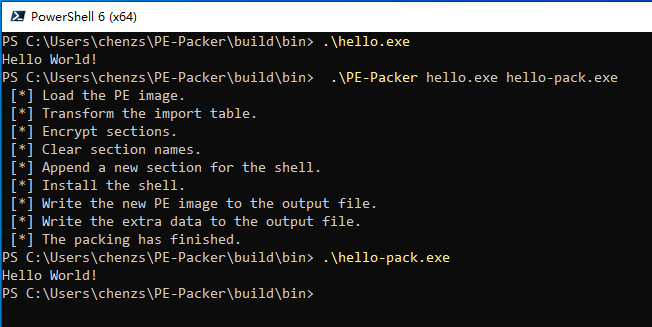

# PE-Packer

## About The Project



*PE-Packer* is a simple packer for Windows PE files. The new PE file after packing can obstruct the process of reverse engineering.

It will do following things when packing a PE file:

- Transforming the original import table.
- Encrypting the sections.
- Clearing the section names.
- Installing the *shell-entry*.

When running a packed PE file, the *shell-entry* will decrypt and load the original program as follows:

- Decrypting the sections.
- Initializing the original import table.
- Relocation.
- Calling functions in the thread-local storage (TLS) table.

### Warning

> This project is just a demo for beginners to study PE Format and Assembly Language. It still has some compatibility problems and bugs that cannot be used in practice.

## Getting Started

### Prerequisites

The project must configuring on/for **Windows** and can only process **32-bit** programs now.

- Install [*MASM32*](http://www.masm32.com/).
- Install [*MinGW-w32*](https://www.mingw-w64.org/).
- Install [*CMake*](https://cmake.org/).
- Set the `PATH` environment variable.

### Building

```powershell
..\PE-Packer> mkdir -p build
..\PE-Packer> cd build
..\PE-Packer\build> cmake .. -D CMAKE_C_COMPILER=gcc -G "MinGW Makefiles"
..\PE-Packer\build> cmake --build .
```

## Usage

To pack a program, you must specify its name and the output name.

```powershell
PE-Packer input-file output-file
```

For example:

```powershell
PE-Packer hello.exe hello-pack.exe
```

## Documents

You can use [*Doxygen*](http://www.doxygen.nl/) to generate the document.

## References

《加密与解密（第3版）》段钢

[PE Format - Windows Dev Center](https://docs.microsoft.com/en-us/windows/win32/debug/pe-format/)

## License

Distributed under the *GNU General Public* License. See `LICENSE` for more information.

## Contact

***GitHub:*** https://github.com/czs108/

***E-Mail:*** chenzs108@outlook.com

***WeChat:*** chenzs108